# Flutter Taste

Audit Flutter apps for taste-building details from **FlutterPro.design** — small design decisions that users feel but can't explain.

## Overview

This skill identifies **29 design concerns** across 11 categories. It works by examining:
1. **Code patterns** — What's present or missing
2. **Widget configurations** — Default behaviors that undermine polish
3. **Interaction details** — Animations, feedback, responsiveness
4. **Platform adaptation** — iOS vs Android expectations
5. **Edge cases** — Null states, loading states, error states

---

## When to Use

Use this skill when the user reports any of these symptoms or asks for these checks:

- "App feels janky / rough / unpolished / unresponsive"
- "Layout shifts when images load" or "content jumps around"
- "Users see 'null' on the screen"
- "Wrong platform feel" (Material on iOS, Cupertino on Android)
- "Buttons feel dead" / "no spring / no bounce"
- "Numbers are hard to read" / "1000000 instead of 1,000,000"
- "Before App Store / Play Store submission, what should I check?"
- "Pre-launch polish checklist"
- "Code review for design polish"
- Lists of specific symptoms → see the decision flowchart below

### Decision Flowchart: Which Category Applies?

```dot
digraph which_category {
    "What does the user have?" [shape=diamond];
    "Web app" [shape=box];
    "Forms with input" [shape=box];
    "Bottom nav / modals / routes" [shape=box];
    "Lists / images / cards" [shape=box];
    "Animations / interactions" [shape=box];
    "iOS + Android" [shape=box];
    "Notifications / fonts / icons / versions" [shape=box];
    "User-generated data display" [shape=box];
    "Nothing specific" [shape=box];

    "What does the user have?" -> "Web app" [label="yes"];
    "What does the user have?" -> "Forms with input" [label="yes"];
    "What does the user have?" -> "Bottom nav / modals / routes" [label="yes"];
    "What does the user have?" -> "Lists / images / cards" [label="yes"];
    "What does the user have?" -> "Animations / interactions" [label="yes"];
    "What does the user have?" -> "iOS + Android" [label="yes"];
    "What does the user have?" -> "Notifications / fonts / icons / versions" [label="yes"];
    "What does the user have?" -> "User-generated data display" [label="yes"];
    "What does the user have?" -> "Nothing specific" [label="nothing matches"];
}
```



Match the symptom to a category number below. **When in doubt, audit Categories 1, 3, and 9** — these cover feel, layout, and null safety, the highest-impact concerns for any app.

## When NOT to Use

This skill is specifically for **design polish and feel**. Do not use it for:

- **Architecture review** (state management, folder structure, dependency injection) → use a general architecture skill
- **Performance optimization** (frame timing, jank profiling, build size) → use Flutter DevTools or a perf skill
- **Accessibility (a11y) audits** (screen readers, contrast, semantics) → use an accessibility skill
- **Functional correctness** (does the feature work?) → use debugging/TDD
- **Business logic review** (validations, edge cases in domain) → not a design concern
- **CI/CD, build, deploy** → use infra/DevOps skills

If the user wants *visual polish, feel, or "what's missing that users feel but can't explain"*, this is the right skill. If they want *what's broken, what works, or how to ship*, route elsewhere.

---

## The 11 Categories & Audit Concerns

### 1️⃣ Animations & Spring Physics
**How it feels to interact with your app**

| Concern | Code Pattern | Anti-Pattern |
|---------|-------------|--------------|
| **Button presses lack spring** | `SingleMotionBuilder` with `CupertinoMotion`/`MaterialSpringMotion` (`motor` pkg); fallback `Curves.elasticOut` | Default `MaterialButton` scale animation (rigid) |
| **List scrolls feel stiff** | `SpringDescription.withDampingRatio()` on scroll | Linear/constant deceleration |
| **Transitions feel jarring** | Physics-based `PageRoute` custom transitions | Instant transitions or uniform-speed fades |

**Audit:** Search code for `GestureDetector` + manual scale—does it use spring physics? Check `PageRoute` implementations—custom physics or defaults?

→ Full patterns: `references/animations.md`

---

### 2️⃣ Visual Feedback & Haptics
**Signals that actions were registered**

| Concern | Anti-Pattern | Checklist |
|---------|-------------|-----------|
| **Material tap splash disabled when unwanted** | Leaving `enableFeedback: true` on custom buttons | ☐ Disable splashes on non-Material buttons |
| **No haptic on confirmations** | Silent state changes (swipes, toggles, selections) | ☐ Use `HapticFeedback.selectionClick()` on form fields |
| **Selection color mismatches design** | Default Material selection (blue highlight) | ☐ Set `ThemeData.textSelectionTheme` (selectionColor + cursorColor + selectionHandleColor) |

**Audit:** Look for `GestureDetector`, custom buttons, `InkWell`—do they suppress or customize feedback? Search `SelectableText` usage—custom colors applied?

→ Full patterns: `references/feedback.md`

---

### 3️⃣ Layout Stability & Spacing
**No sudden jumps or clipping**

| Concern | Anti-Pattern | Fix |
|---------|-------------|-----|
| **Images cause layout shift** | `Image.network()` without `height`/`width` set | Decide the box before bytes load: `SizedBox(w, h, child: Image(...))`, `AspectRatio(16/9, child: Image(...))`, or `Expanded` when parent fixes height. `fit` alone does not reserve space. `Expanded` needs a bounded main axis (OK in `Column`, not in `ListView`). |
| **Images pop in without transition** | Default `Image` widget renders abruptly when decoded | Use `image_fade`'s `ImageFade` (placeholder → fade-in). Keep placeholder subtle (solid grey / shimmer); avoid spinners |
| **Horizontal lists clipped by page padding** | Page scrollable (`SingleChildScrollView`/`ListView`) with `EdgeInsets.symmetric(horizontal: 16)` clips inner horizontal `ListView` to that gutter | Keep page scrollable edge-to-edge (no horizontal padding); give each child its own `padding` so horizontal lists reach the screen edges |
| **SafeArea breaks scrollable widgets** | `SafeArea(child: ListView(...))` shrinks viewport, cutting off items and killing edge swipes | Use `MediaQuery.viewPaddingOf(context).bottom` — add a trailing `BottomPadding` widget or `padding: EdgeInsets.only(bottom: viewPadding.bottom)` |
| **Lists don't hint at scrollability** | No edge fade, list feels static | Wrap in `ShaderMask` with `LinearGradient` (`blendMode: BlendMode.dstIn`, stops `[0.0, 0.12, 0.88, 1.0]`, transparent→solid→transparent); also set `physics: AlwaysScrollableScrollPhysics()` for short lists |

**Audit:** Find all `Image` widgets—have explicit dimensions? Search `SafeArea` + scrollable—should remove it. Check `ListView` horizontal—padding applied naively?

→ Full patterns: `references/data.md` (images, skeleton, fade-in) and `references/forms.md` (SafeArea pattern)

---

### 4️⃣ Text & Number Formatting
**How numbers and text appear**

| Concern | Anti-Pattern | Solution |
|---------|-------------|----------|
| **Numbers shift width** | `Text('$price')` where price varies (10 → 100) | Use monospace or tabular figures: `Text(..., style: TextStyle(fontVariations: [FontVariation('wdth', 50)]))` or `fontFeatures: [FontFeature.tabularFigures()]` |
| **Large numbers unreadable** | `Text('$1000000')` not grouped | Use `NumberFormat` from `intl`: `NumberFormat('#,##0').format(value)` |
| **Null values shown to users** | `Text(user?.name ?? '')` → empty or "null" string | Always provide fallback: `Text(user?.name ?? 'Guest')` |
| **Date/time unformatted** | Raw DateTime string or timestamp | Use `DateFormat('MMM d, yyyy', 'en_US').format(date)` |

**Audit:** Find all `Text()` with dynamic numbers—formatted? Search for `??` or `?.` on display fields—fallbacks safe? Look for null-coalescing to empty strings.

→ Full patterns: `references/data.md` (NumberFormat, DateFormat, tabular figures)

---

### 5️⃣ Input & Keyboard Handling
**Forms that don't fight the user**

| Concern | Anti-Pattern | Fix |
|---------|-------------|-----|
| **Single-field pages don't autofocus** | Form page loads, keyboard doesn't appear | Add `autofocus: true` to sole `TextField` or call `FocusScope.of(context).requestFocus(_focusNode)` in `initState` |
| **Keyboard persists while scrolling** | Typing in form, keyboard blocks content as user scrolls | Wrap form in `GestureDetector(onTap: FocusManager.instance.primaryFocus?.unfocus)` or use `Flutter Keyboard Visibility` package |
| **Text input lacks proper styling** | Default `TextField` outline or underline doesn't match design | Apply custom `InputDecoration` or use `Material Design 3` adaptive inputs |

**Audit:** Do single-field forms set `autofocus: true`? Search for form `Column`—does scrolling dismiss keyboard? Check `TextField` styling—matches brand?

→ Full patterns: `references/forms.md`

---

### 6️⃣ Navigation & State Transition
**Smooth, predictable movement through the app**

| Concern | Anti-Pattern | Solution |
|---------|-------------|----------|
| **Bottom nav doesn't scroll to top on retap** | Tapping active tab does nothing or pushes new route | Use long-lived per-tab `ScrollController` (+ `FocusNode`): `if (index == _currentIndex) animateTo(0)`, else focus search |
| **Modal sheet is iOS 13 style on iOS 15+** | Using `showModalBottomSheet()` without platform adaptation | Use `showAdaptiveBottomSheet()` or `CupertinoModalPopupRoute` on iOS |
| **Android back button doesn't close custom modals** | Custom modal (`AlertDialog` variant) ignores Android back | Wrap in `PopScope(canPop: true, child: ...)` (Flutter 3.12+). On Android 13+, ensure `android:enableOnBackInvokedCallback="true"` in `AndroidManifest.xml` |
| **No navigation feedback** | Instant page swaps with no transition | Apply custom `PageRoute` with spring physics or Material/Cupertino built-in transitions |

**Audit:** Does bottom nav have controller + scroll handler? Check sheet implementations—platform-aware? Custom dialogs handling back button? Routes using defaults or custom?

→ Full patterns: `references/navigation.md` (sheets, back button, routes, web titles)

---

### 7️⃣ Platform Adaptation
**Feeling native on iOS and Android**

| Concern | Anti-Pattern | Fix |
|---------|-------------|-----|
| **Date picker doesn't match platform** | `CupertinoDatePicker` (iOS wheel) on Android, or `showDatePicker()` on iOS | iOS: `CupertinoDatePicker` in a bottom sheet with a "Done" button. Android: default `showDatePicker()`. See `navigation.md` Pattern 5. |
| **Material ripples on iOS** | `InkWell` hardcoded; no `GestureDetector` alternative | Detect platform and apply `CupertinoButton` on iOS, `Material` button on Android |
| **SafeArea ignores iOS notches** | Not accounting for `MediaQuery.of(context).padding` in custom layouts | Use `MediaQuery` for safe zone or let `SafeArea` handle (correctly, on non-scrollables) |

**Audit:** Find `showDatePicker()`, `InkWell`, Material buttons—platform checks applied? Test on both platforms—feel native?

→ Full patterns: `references/platform.md` (file saving) and `references/navigation.md` (date picker, sheets)

---

### 8️⃣ Web-Specific Polish
**Flutter web apps that don't feel like foreign widgets**

| Concern | Anti-Pattern | Solution |
|---------|-------------|----------|
| **Browser tab title never changes** | `onGenerateTitle` (reruns only on rebuild, not navigation); `dart:html` + `html.document.title`; `SystemChrome.setApplicationSwitcherDescription()` (mobile-only) | Wrap each route's tree in `Title(title: ..., color: ..., child: ...)`. For `go_router`, wrap `MaterialApp.router` `builder` in a `ListenableBuilder` on `routerDelegate` + `routeInformationProvider` and map `uri.path` → title. `Title.color` must be opaque (`0xFF`). See `navigation.md` Pattern 1. |
| **No loading progress indicator** | Web loads with blank white screen | Customize `index.html` with `loading_spinner.html` before Flutter init or use `flutter_web_splash` |
| **Missing social preview (Open Graph)** | Link preview shows default Flutter logo | Add `<meta>` tags in `index.html` or dynamically inject via route |

**Audit:** Check web `index.html`—custom loader? Are route changes updating page title? Has OG meta tags?

→ Full patterns: `references/navigation.md` (web section)

---

### 9️⃣ Data & Null-Safety UX
**Graceful handling of empty, loading, and error states**

| Concern | Anti-Pattern | Checklist |
|---------|-------------|-----------|
| **Null values displayed as strings** | `.toString()` on null objects → "null" on screen | ☐ Use fallbacks: `user?.name ?? 'Unknown'` ☐ Build null states with placeholders |
| **No loading placeholder** | Images/lists pop in suddenly, layout shift | ☐ Reserve space: `SizedBox(height: 200, child: Image(...))` ☐ Use skeleton loaders ☐ Fade-in animations |
| **Error states hidden** | Network fail → blank screen or crash | ☐ Show readable error messages ☐ Offer retry ☐ Log for debugging |
| **Empty states confuse** | Empty list looks like it's loading | ☐ Show icon + message ☐ Use distinct visual treatment |

**Audit:** Search codebase for `??` on display values—always safe? Do lists/images reserve space? Are error screens user-friendly?

→ Full patterns: `references/data.md` (null handling, loading/error/empty states)

---

### 1️⃣0️⃣ Interaction Hints & Discoverability
**Showing users what's possible**

| Concern | Anti-Pattern | Solution |
|---------|-------------|----------|
| **Swipe actions invisible** | `Slidable` or custom swipe with no hint, user doesn't know to swipe | Run a one-time preview on first appearance: own a `SlidableController` (`SingleTickerProviderStateMixin`), call `openStartActionPane()` / `openEndActionPane()` then `close()` with short delays and `mounted` guards. Trigger via a flag (e.g. `isFirst: index == 0`) or `Once.runOnce` so it doesn't replay on rebuilds |
| **Scrollable content doesn't indicate scroll** | List feels static, users don't swipe | Apply `ShaderMask` with fade gradient at edges or use scroll position indicator |

**Audit:** Are hidden actions revealed on load? Do scrollable regions have visual cues (fade, indicator, chevron)?

→ Full patterns: `references/animations.md` (Slidable preview)

---

### 1️⃣1️⃣ Performance & Polish Details
**Micro-optimizations that compound**

| Concern | Anti-Pattern | Fix |
|---------|-------------|-----|
| **Icons pop in late** | Icon assets load on first use, decoding shows 1–2 frames late | Precache during splash: `precacheImage(AssetImage(path), context)` for raster; for SVG use `flutter_svg`'s `SvgAssetLoader` + `svg.cache.putIfAbsent(...)`. `await` user-visible icons, fire-and-forget the rest |
| **GoogleFonts causes jank** | Font downloaded on first use → visible swap from default font to chosen font (FOUT) before frame one | Preload before `runApp`: `await GoogleFonts.pendingFonts([GoogleFonts.inter(fontWeight: FontWeight.w400), GoogleFonts.inter(fontWeight: FontWeight.w700)])` in `main()`. Each `GoogleFonts.xxx()` call only loads ONE weight+style — preload every weight/style used, or fall back to bundled font files |
| **No changelog on update** | Users update app, no indication of what changed | Compare `PackageInfo.fromPlatform().version` (via `package_info_plus`) with `prefs.getString('last_seen_version')` (via `shared_preferences`) using `pub_semver`'s `Version.parse`; on first install save current + skip; on upgrade from `1.2.0`→`1.5.0` accumulate **all** entries in between (not just latest); show via `showDialog()` then persist new version |
| **Notifications broken after TZ change** | `zonedSchedule` fires at wrong local time after travel or DST | On `AppLifecycleListener.onResume`: read name via `FlutterTimezone.getLocalTimezone().identifier` + offset via `tz.TZDateTime.now(tz.local).timeZoneOffset.inMilliseconds`, compare to last saved in `SharedPreferences`; if either differs, `cancelAll()` + `rescheduleAllNotifications()` |

**Audit:** Are icon assets precached? GoogleFonts applied at startup? Check version after build—changelog shown? TZ handling in notification code?

→ Full patterns: `references/data.md` (precache) and `references/platform.md` (notifications, TZ)

---

## Audit Workflow

### Step 1: Categorize Your App
Answer these questions:
- Is this a web app? (Category 8️⃣)
- Does it have forms? (Category 5️⃣)
- Has navigation with tabs/modals? (Category 6️⃣)
- Displays user-generated data? (Category 9️⃣)
- Has animations/interactions? (Categories 1️⃣–2️⃣)
- Targets both iOS and Android? (Category 7️⃣)

### Step 2: Run Code Grep
For each relevant category, search your codebase:

```bash
# Example: Find all GestureDetectors (missing spring physics?)
grep -r "GestureDetector" lib/ --include="*.dart"

# Find all TextField and Image widgets (autofocus? sizing?)
grep -r "TextField\|Image\." lib/ --include="*.dart"

# Find null-coalescing on display (unsafe fallbacks?)
grep -r "?? ''" lib/ --include="*.dart"

# Find all navigation routes (platform adaptation?)
grep -r "showModalBottomSheet\|Navigator.push" lib/ --include="*.dart"
```

### Step 3: Evaluate Each Hit
For each match:
1. **Is this concern relevant?** (Some apps don't need swipe actions, for example.)
2. **Does the code pattern match anti-pattern?** (Use the table for this.)
3. **What's the fix cost?** (Quick config change vs. major refactor?)

### Step 4: Create Audit Report
Build a checklist:
```
✅ Animations: Spring physics on buttons
❌ Feedback: Text selection color not customized
⚠️  Layout: SafeArea on scrollable (might be OK—check)
✅ Navigation: Bottom nav has scroll-to-top
...
```

---

## Common Patterns to Search

```dart
// ❌ Anti-Pattern: Default GestureDetector (no spring)
GestureDetector(
  onTap: () { },
  child: Transform.scale(scale: _scale, child: button),
)

// ✅ Pattern: GestureDetector with spring physics
GestureDetector(
  onTap: () { },
  onTapDown: (_) {
    controller.forward();
  },
  onTapUp: (_) {
    controller.reverse();
  },
  child: AnimatedBuilder(
    animation: controller,
    builder: (context, child) {
      final springValue = Curves.elasticOut.transform(controller.value);
      return Transform.scale(scale: 1.0 - (0.1 * springValue), child: child);
    },
    child: button,
  ),
)
```

```dart
// ❌ Anti-Pattern: Image without size (layout shift)
Image.network(imageUrl)

// ✅ Pattern: Image with reserved space
SizedBox(
  height: 200,
  child: Image.network(imageUrl, fit: BoxFit.cover),
)

// ✅ Pattern: Known aspect ratio
AspectRatio(
  aspectRatio: 16 / 9,
  child: Image.network(imageUrl, fit: BoxFit.cover),
)

// ✅ Pattern: Parent fixes the height (Expanded needs bounded main axis — Column OK, ListView not)
SizedBox(
  height: 320,
  child: Column(
    children: [
      Expanded(child: Image.network(imageUrl, fit: BoxFit.cover)),
      // title, price, button
    ],
  ),
)
```

```dart
// ❌ Anti-Pattern: Null display
Text(user?.name ?? '')

// ✅ Pattern: Safe fallback
Text(user?.name ?? 'Guest User')
```

---

## Tools & Commands

**Search by concern category:**
```bash
# Find all Material buttons (check for feedback customization)
grep -r "MaterialButton\|ElevatedButton\|TextButton" lib/

# Find Image widgets (check sizing)
grep -r "Image\." lib/

# Find keyboard/form code (check autofocus, dismissal)
grep -r "TextField\|FocusNode\|KeyboardListener" lib/

# Find navigation (check platform adaptation)
grep -r "showModalBottomSheet\|Navigator\|PageRoute" lib/

# Find null-coalescing (check fallback safety)
grep -r " ?? " lib/ | grep -i "text\|display\|name"

# Find animations (check physics)
grep -r "AnimationController\|Tween\|Curve" lib/
```

---

## Complete Item Mapping (All 29 from FlutterPro.design)

Patterns labeled "SKILL.md §X" live inline in the category table above; patterns labeled with a `references/X.md` filename have a full implementation guide in that reference.

| # | Item | Category | Reference |
|---|------|----------|-----------|
| 1 | Match the date picker to the platform | 7️⃣ Platform | `references/navigation.md` |
| 2 | Save files without permission handling | 7️⃣ Platform | `references/platform.md` |
| 3 | Dismiss the keyboard when users scroll a form | 5️⃣ Forms | `references/forms.md` |
| 4 | Update browser tab title on each page | 8️⃣ Web | `references/navigation.md` |
| 5 | Don't clip horizontal lists with page padding | 3️⃣ Layout | SKILL.md §3 |
| 6 | Autofocus pages that have one field | 5️⃣ Forms | `references/forms.md` |
| 7 | Scroll to top when tab is tapped again | 6️⃣ Navigation | `references/navigation.md` |
| 8 | Use tabular figures for numbers that change | 4️⃣ Text | `references/data.md` |
| 9 | Missing haptic types, and which to use when | 2️⃣ Feedback | `references/feedback.md` |
| 10 | Fix the GoogleFonts glitch | 1️⃣1️⃣ Performance | SKILL.md §11 |
| 11 | When Android back button doesn't close your modals | 6️⃣ Navigation | `references/navigation.md` |
| 12 | Load images smoothly | 3️⃣ Layout | `references/data.md` |
| 13 | Make animations feel alive with springs | 1️⃣ Animations | `references/animations.md` |
| 14 | Show changelog after update | 1️⃣1️⃣ Performance | SKILL.md §11 |
| 15 | Reserve space for images so layout doesn't jump | 3️⃣ Layout | `references/data.md` |
| 16 | Disable Material tap effects | 2️⃣ Feedback | `references/feedback.md` |
| 17 | Show progress while Flutter web loads | 8️⃣ Web | `references/navigation.md` |
| 18 | Never let users see "null" | 9️⃣ Data | `references/data.md` |
| 19 | Show users your swipe actions exist | 1️⃣0️⃣ Interactions | SKILL.md §10 |
| 20 | Make text selection match your design | 2️⃣ Feedback | `references/feedback.md` |
| 21 | Make lists feel scrollable | 3️⃣ Layout | SKILL.md §3 |
| 22 | Add link preview (Open Graph) to your Flutter Web app | 8️⃣ Web | `references/navigation.md` |
| 23 | Upgrade your iOS 13 sheets to iOS 26 | 7️⃣ Platform | `references/navigation.md` |
| 24 | Format numbers for humans | 4️⃣ Text | `references/data.md` |
| 25 | Reschedule notifications when timezone or clock changes | 1️⃣1️⃣ Performance | SKILL.md §11 |
| 26 | Precache icons so they don't pop in | 1️⃣1️⃣ Performance | SKILL.md §11 |
| 27 | Make button presses feel right | 1️⃣ Animations | `references/animations.md` |
| 28 | Don't use SafeArea with scrollable widgets | 3️⃣ Layout | SKILL.md §3 |
| 29 | Dismiss the keyboard before opening a modal | 5️⃣ Forms | `references/forms.md` |

**Coverage: 29/29 items (100%)** — 21 in dedicated `references/*.md` files, 8 inline in SKILL.md category tables (those marked "SKILL.md §X" above; the patterns are short enough to live in the audit checklist).

---

## Reference Files

For detailed patterns, code snippets, and implementation examples:
- `references/animations.md` — Spring physics, curves, transitions
- `references/feedback.md` — Haptics, Material splash, text selection
- `references/data.md` — Null safety, formatting, loading states
- `references/forms.md` — Input styling, autofocus, keyboard
- `references/navigation.md` — Sheets, bottom nav, routes, web
- `references/platform.md` — File saving, platform adaptation

Each reference includes:
- Pattern templates (copy-paste ready)
- Package recommendations
- Platform-specific notes
- Common pitfalls

### Worked Examples

See `TEST_CASES.md` for end-to-end usage examples: e-commerce audits, social app polish, code-review walkthroughs, web-specific concerns, and platform adaptation. The audit script in `scripts/audit.sh` automates the grep-based checks shown in the Audit Workflow below.

---

## FAQ

**Q: Do I need to fix all 29 concerns?**
No. Prioritize:
1. **High-impact**: Null display, layout shifts, modal/nav bugs
2. **Medium**: Spring animations, haptics, platform adaptation
3. **Polish**: Icon precaching, GoogleFonts loading, notification TZ

**Q: How do I know which category applies?**
The 11 categories map to app features. If your app has tabs, audit Category 6️⃣ (navigation). If it displays user data, audit Category 9️⃣ (null safety). Most apps benefit from Categories 1️⃣–3️⃣ (feel) and 9️⃣ (data).

**Q: Should I use third-party packages?**
Some concerns (NumberFormat, DateFormat) require `intl`. Others (spring physics, platform UI) are in-framework. Check references for package recommendations.

**Q: How much time to audit?**
- **Quick scan** (categories relevant to your app): 30 min
- **Deep audit** (all categories + code review): 2–3 hours
- **Full fixes**: Varies, but most are <30 min each

---

## Next Steps

1. **Identify your app's categories** — What features matter?
2. **Search codebase** — Use grep commands above
3. **Compare against patterns** — Match your code to tables
4. **Create checklist** — Track high, medium, polish tiers
5. **Fix by priority** — Start with high-impact, visible concerns
6. **Test on real devices** — iOS and Android
7. **Iterate** — Small polish compounds into great feel

See references for implementation details, copy-paste snippets, and common gotchas.
